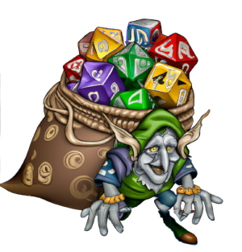

# Part 1: Creating a Die Roller

Adventure Quest is an adventure game that will take inspiration from table top
role playing games such as Dungeons & Dragons, Swords & Sorcery, and Fate Core.
In these games, randomness is often accomplished by rolling one or more dice.
Adventure Quest will model its randomness in the same way!

That said, we're not talking about traditional 6 sided die. No, no, no! These
games bring out giant sacks of dice with varying sizes and combinations.

In this part, you will create a Die Roller Scene in Unity that allows the user
to simulate rolling multi-sided dice.

## [Chapter 1: Modeling a Die]()

In this chapter, you will have written a `Die` class which models a multi-sided
die that can be rolled. Additionally, you will learn how to use the Unity Test
Framework to test the `Die` class, giving you confidence that it works as
expected.

## [Chapter 2: Creating a Die Roller Scene]()

In this chapter, you will create a Scene with a button that connects to an
instance of the `Die` class. When the button is clicked, the `Die` is rolled and
the result is reported to the console.

## [Chapter 3: Adding an OnRoll Event]()

In this chapter, you will learn how to add UnityEvents to your scripts which
allow you to update elements on the screen when a `Die` is rolled.

## [Chapter 4: Creating a Die Button Prefab]()

In this chapter, you learn how to create a `Prefab` for a `Die Button` to manage
the complexity of adding new buttons and updating existing buttons throughout
your project.
