# Chapter 2: Creating a Die Roller Scene
{: .no_toc }
In this part, we will be creating a Scene in Unity that allows us to roll
different sided dice. Before starting, be sure you've completed [Chapter 1:
Modeling a Die] and that all of your
tests are passing.

<details open markdown="block">
  <summary>
    Table of contents
  </summary>
  {: .text-delta }
1. TOC
{:toc}
</details>

# 01. Create a Scene

A **Scene** in Unity is where you work with part of a game or application. In
this section, we will create a Die Roller Scene that allows the user to click on
buttons to roll dice with varying sides.

1. Open the `Scenes` folder.
2. Right click and select `Create` > `Scene`
3. Rename the Scene to be `Die Roller`
4. Double click to open the `Die Roller` scene.

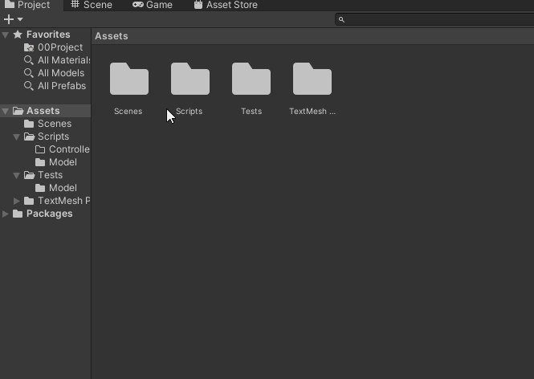

5. Verify that you have the `Die Roller` scene open. In the `Hierarchy` view,
   you should see `Die Roller` at the very top.

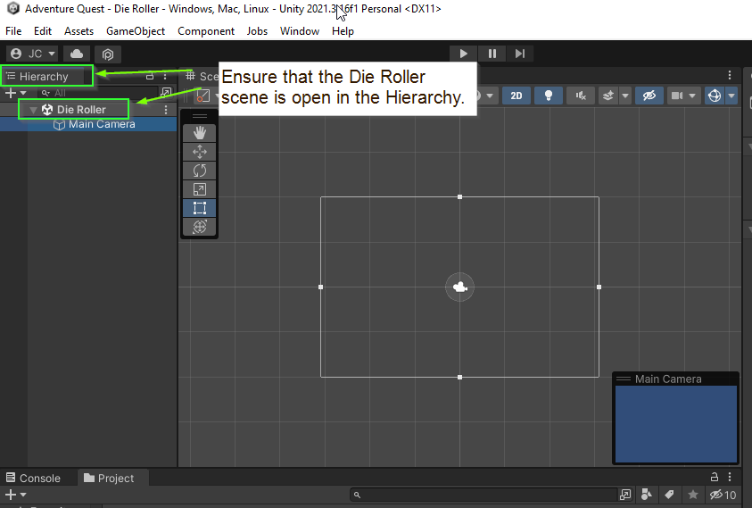

# 02. Setup Screen Dimensions

To make our lives a little easier, we will limit our game to use a standard
monitor aspect size: `16:9`. This is an aspect ratio and it means that for every
16 pixels wide, the screen is 9 pixels tall. This is a common screen resolution
and includes HD (1920x1080) and 4K UHD (2840x2160).

**Note:** By default, Unity selects a `Free Aspect` which means it will try to accommodate
*ANY* screen size. As awesome as this might sound, it turns out to be a bit of a
challenge to make it work in practice.

1. Click the `Game` Panel
2. Click the `Aspect Drop Down` (It probably says Free Aspect)
3. Select `16:9 Aspect`

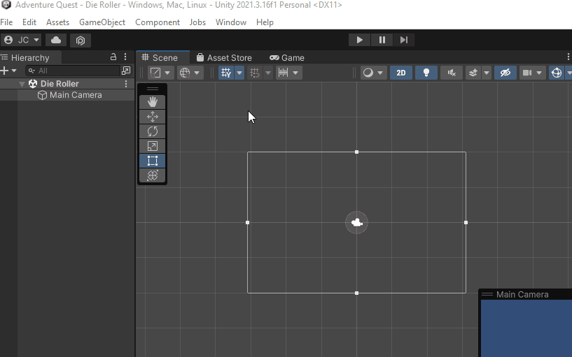

4. Finally, return back to the `Scene` panel.

# 03. Adding a Button to the Scene

Next, let's add a Button to the scene.

1. Right click in the hierarchy
2. Select `UI` > `Button - TextMeshPro`


After a moment, you will likely see a massive button appear in the `Scene` along
with several items in the `Hierarchy`: A `Canvas`, a `Button`, a `Text`, and an
`EventSystem`.

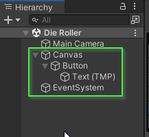

A `Canvas` is Unity's main way for adding `HUD` / `UI` elements to the game
screen. The `EventSystem` is the way `Unity` tracks user clicks / interactions
with the `Canvas`. Finally, the `Button` is the actual button on the screen and
the `Text` is the text that is displayed within the button.

# 04. Adjusting the Canvas

So... how do we make the button look reasonable?

There are a few things happening here. By default, a `Canvas` is set up to
render over an entire screen rather than onto the scene directly. This is important
in 3D games as well as 2D games that go outside of the bounds of what the player sees.
What would it mean to have the canvas be in the game world?

Instead, the Canvas renders on top of what the player sees. If you were to click
to the `Game` panel, you would see the Button how it would appear to the user. If you're 
lucky, you will see the button somewhere on the screen. However, this will be dependent
on the size of the `Game` panel itself. If you drag the screen around, you will see the
button position on the screen move about.

3. Open the `Game` Panel
4. Resize the window to see the button move

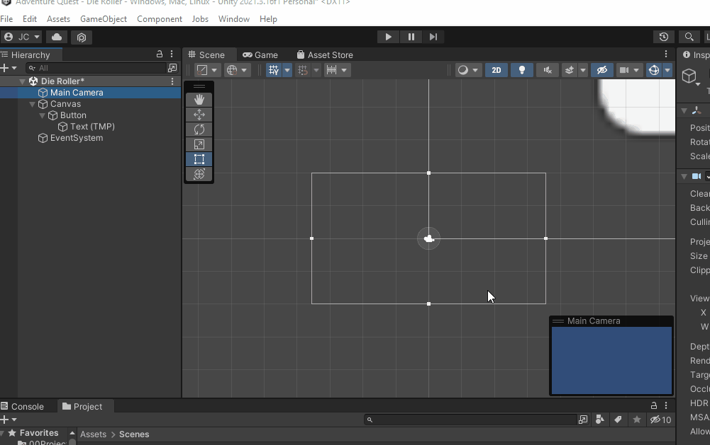

What is happening?

The default behavior of the canvas is to maintain a **constant** pixel size.
This means that, although the aspect is remaining constant, the size of the
button and the text will always have the same size. If we select the `Canvas` in
the `Hierarcy`, We can see this in the `Inspector` panel under the `Canvas
Scaler` section.

5. Click the `Canvas` in the `Hierarchy`
6. Open the `Inspector` panel.
7. Find `Canvas Scaler` in the `Inspector` panel.

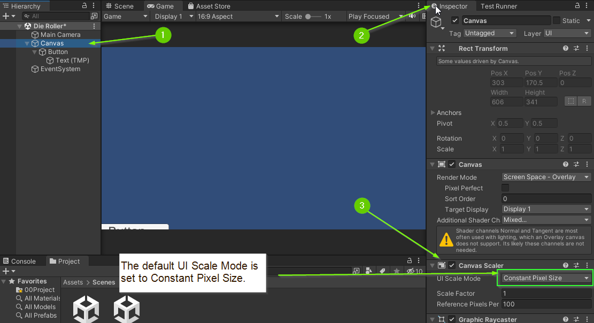

How do we fix it?

For this scene, we would like the `Canvas` to scale to the size of the screen.

1. Set `UI Scale Mode` to be `Scale With Screen Size`
2. Set the resolution to be `1920` x `1080` (this is a 16:9 aspect)

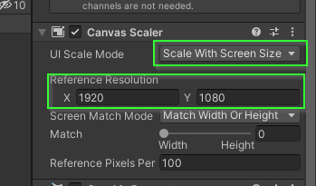

As you do this, you should see the `Button` adjust its position on the screen.
However, if you resize the `Game` panel, the button scales to match the new
resolution!

# 05. Positioning the Button

If you return to the `Scene` panel, you will still see that the `Canvas` is
massive compared to the scene. If you double click the `Canvas` in the
`Hierarchy`, the `Scene` view will zoom out and center the `Canvas` within the
panel. In fact, double clicking on any component in the `Hierarchy` will center
it in the `Scene` panel.

1. Double click on the `Canvas` in the `Hierarchy`
2. Double click the `Main Camera` in the `Hierarchy`

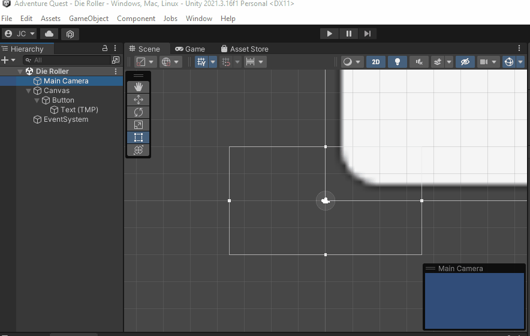

With our `Canvas` visible, let's adjust the button to be at the bottom of the screen
with a reasonable size.

1. Select the `Button` in the `Hierarchy`
2. Find the `Rect Transform` component in the `Inspector` panel.
3. Click the **Anchors** icon
4. Select `Bottom` and `Center`

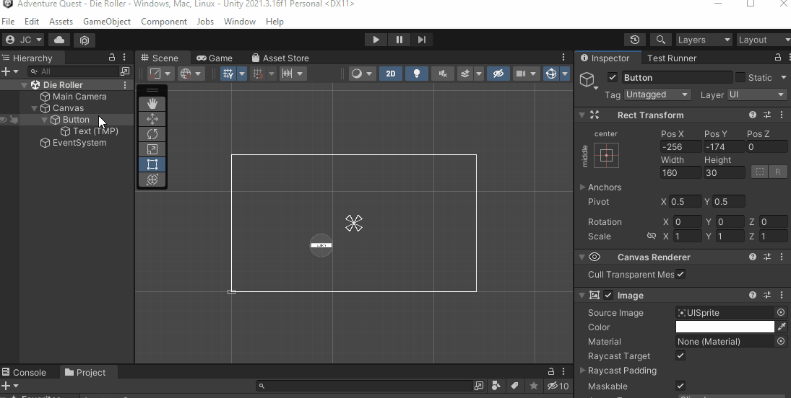

This updates how the `Pos X` and `Pos Y` properties are displayed. This makes them relative
to the Bottom and Center position on the `Canvas`

5. Next, update the `Pos X` and `Pos Y` to be 0

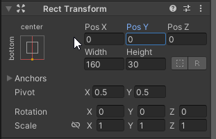

Because the anchors are set to the bottom and center of the screen, this centers
the button at that point.

This isn't quite what we want. You'll notice that the bottom half of the button is now off the screen.
This is because the `Pivot` of the `Button` is set to be the center point of the `Button`. We can adjust it
to be the bottom of the button by changing the `Pivot`'s Y to 0.

6. Set the Pivot to 0
7. Update `Pos Y` to be 0

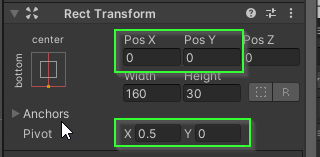

If all went well, your button is now at the bottom center of the screen. If
you'd like to give it a little padding, you can set `Pos Y` to be slightly
positive.

# 06. Sizing the Button

By default, Unity sets a button to be `160` pixels wide and `30` pixels tall. Because we have
set our canvas to have a size of `1920x1080` the button appears quite small on the screen.
Let's update the size!

1. Set the buttons width to be 300
2. Set the buttons height to be 200

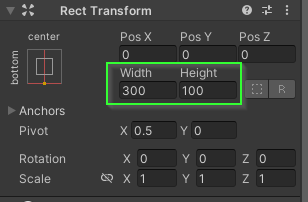

Because we have set the anchors and pivot to be the bottom center of the canvas,
the button scales up and remains centered at the bottom of the screen.

However, the text did not change size. This is because the `Text` is its own component
in the scene that happens to be nested within the `Button`.

3. Select the `Text` from the `Hierarchy`
4. Find the `TextMeshPro` component in the `Inspector`
   * You may have to scroll down to find it. 
5. Change the Text from `Button` to `Roll Die!`
6. Change the `Font Size` to be `72`.

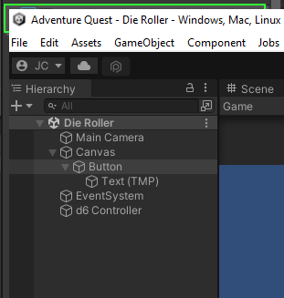

If all went well, the text on your button is now legible!

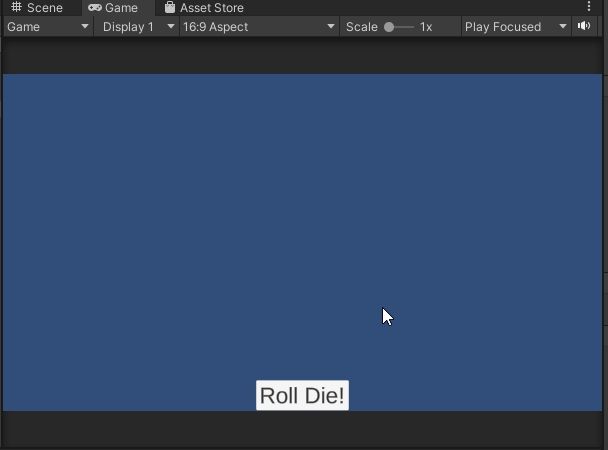

# 07. Creating a DieController

Next, we want to make the button do something! To do this, we will 
create a `MonoBehaviour` called `DieController`.

1. Open the `Scripts/Controller` folder
2. Right click
3. Select `Create` > `C# Script`
4. Name the script `DieController`
5. Double click to open the script

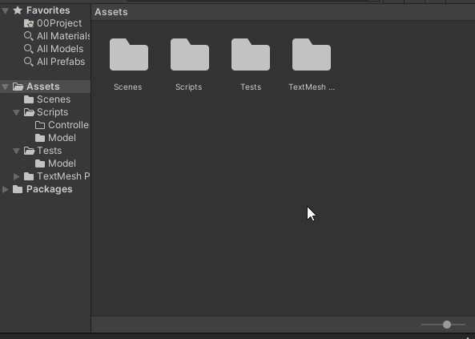

We will use a `DieController` to... well... control a `Die`. More specifically a
`DieController` defines how a `Die` interacts with a `Scene`. 

1. Update your `DieController` script:

```csharp
using UnityEngine;

namespace AdventureQuest.Dice
{
    public class DieController : MonoBehaviour
    {

        private Die _die;

    }
}
```

* Because the `DieController` is tightly coupled with the `Die` class, we will
  add it to the `AdventureQuest.Dice` name space.
* To be able to attach a `DieController` to our `Button`, it must be a `MonoBehaviour`.
* Additionally, because a `DieController` controls a `Die` we add a `Die`
  field. 
  
**Notice**: we have specified that the `_die` field is `private`. This means
that the `_die` variable will only ever be accessed within this file preventing
us (or our dev-team) from accidentally writing a bug that modifies / uses it in
some way. Additionally, the naming convention for `private` fields in C# is to
prefix with an underscore (_) and use camelCase.

1. Add a `Start()` method which initializes `_die` to be a 6 sided `Die`.

```csharp
public class DieController : MonoBehaviour
{

    private Die _die;
    
    void Start()
    {
        _die = new Die(6);
    }
}
```

The `Start()` method is a "magic" method that Unity looks for on
`MonoBehaviour`s. If one exists, it will be called **WHEN** the `MonoBehaviour`
enters the scene (when it "starts"). This acts similar to a constructor for
`MonoBehaviour`s and gives us an opportunity to initialize it. In this case,
we initialize the variable to be a new `Die` with 6 sides.

3. Add a Roll method which rolls `Die` and reports the result using `Debug.Log`

```csharp
public class DieController : MonoBehaviour
{
    // omitted for brevity
    
    public void Roll()
    {
        _die = new Die(Sides);
        Debug.Log($"Rolled a {_die.LastRolled}");
    }
}
```

The above method calls the `Die.Roll` method which causes the state of the `Die`
to change. Then, using `Debug.Log` displays the result of the roll in Unity's
console. All that is left to do is connect it to our button!

# 08. Adding a DiceController to the Scene

Let's add a `DieController` to the scene.

1. Right click in the `Hierarchy` panel
2. Select `Create Empty`
3. Rename the Game Object `d6 Controller`

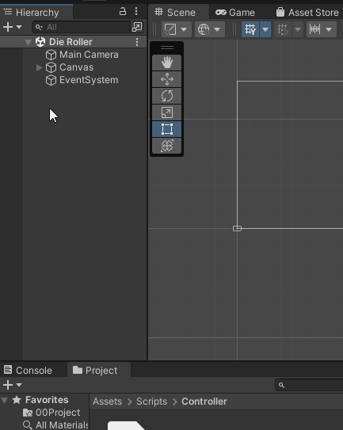

4. Select the `d6 Controller` in the `Hierarchy`
5. In the `Inspector` panel click `Add Component` 
6. Search for `DieController`
7. Select `DieController`

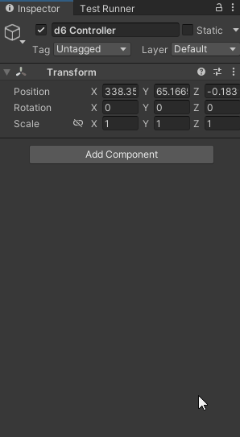

If all went well, a `Die Controller` component is now visible in the inspector.

# 09. Rolling on Button Click

Next, we need to attach the `Roll` method to the `Button`'s `OnClick` event.

1. Select the `Button` in the `Hierarchy`
2. In the `Inspector` panel, find the `Button` component (you may need to scroll down)

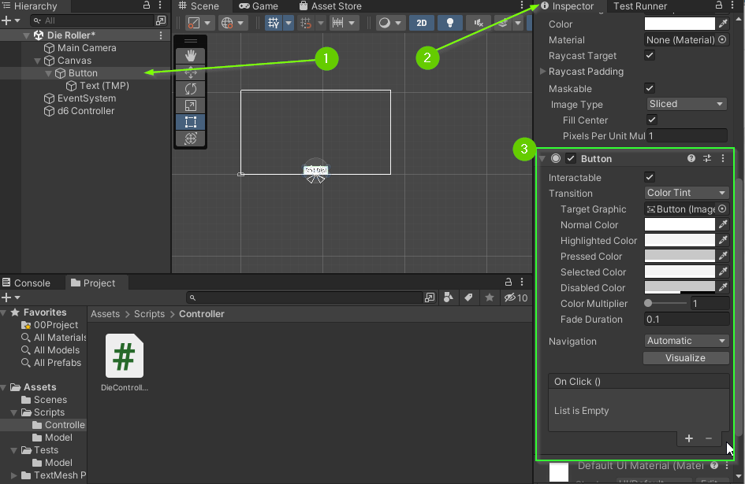

At the bottom of the `Button` component, you will see a box labeled `OnClick()`.
This is a `UnityEvent` that `GameObject`s can "listen" to and be notified when
the button is clicked.

3. Click the `+` icon on the `On Click ()` event to add a **listener**
4. Drag the `d6 Controller` from the `Hierarcy` into the box that says `None (Object)`.

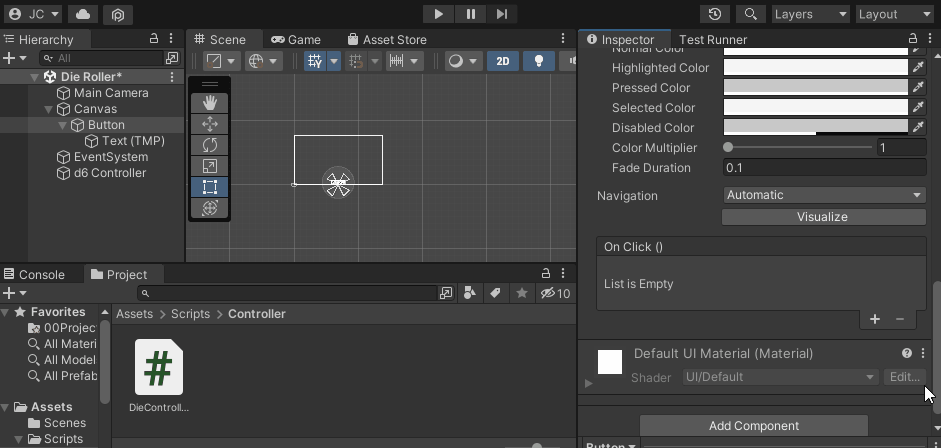

This registers the `d6 Controller` to listen for button clicks. All that is left to do
is specify what it should do when the button is clicked.

5. Click the drop down menu that is labeled `No Function`
6. Select `DieController` > `Roll()`

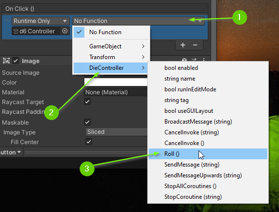

By doing this, we have specified that we would like the `Roll()` method to be
invoked anytime the button is clicked.

## Test it out
{: .no_toc }
Whew! That was a lot of work!

7. Click the `Run` button to launch the scene
8. Click the `Roll Die!` button
9. Open the `Console` panel

If all went well, you should see the output of the `Debug.Log` in your console.

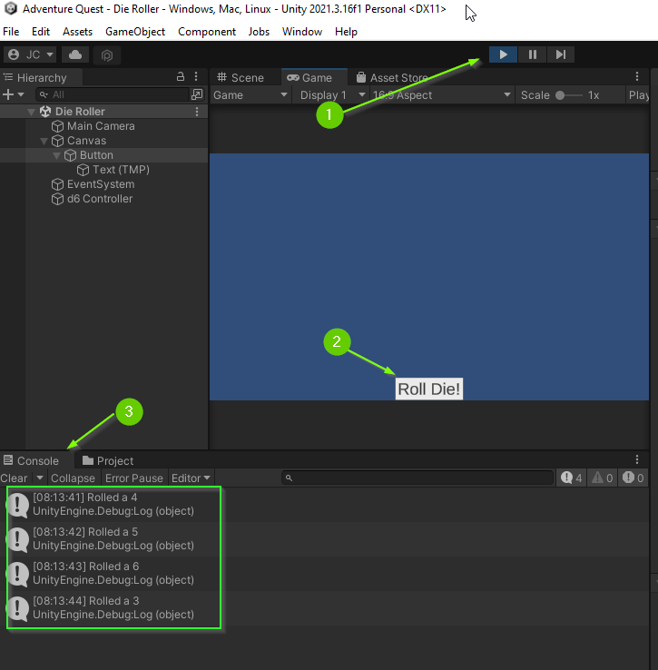

# 10. Generalizing the DieController

Alright! We are now able to roll a 6 sided die. But we want to do be able to
roll dice of all shapes and sizes!

To do this, we will add a `int Sides` property to our `DieController` that will
specify how many sides the underlying die should be initialized with.
Additionally, we will expose that property to the `Inspector` panel so we can
set it in the editor.

1. Update the `DieController` class to have a `Sides` property that has a
   `private set` and initialized to `6`. (Don't forget to update your
   constructor)

```csharp
public class DieController : MonoBehaviour
{

    public int Sides { get; private set; } = 6;
    private Die _die;
    
    void Start() 
    {
        _die = new Die(Sides); // <-- This line changed!
    }
    public void Roll() { // omitted for brevity }
}
```

Because `Sides` should never change, we use `private set` to ensure that no one
changes it later. Unfortunately, this means that the `Inspector` cannot see it.
However, there is a work around! Unity provides a `[field: SerializeField]`
attribute which allows us to modify a **field** in the `Inspector` without
exposing it as `public` to the rest of the program.

2. Add the `[field: SerializeField]` attribute to the `Sides` property.

```csharp
public class DieController : MonoBehaviour
{

    [field: SerializeField]
    public int Sides { get; private set; } = 6;
    
    // omitted for brevity
}
```

Now, if we view the `DieController` in the inspector, we can adjust the number
of sides the `Die` will initialize with.

3. Select the `d6 Controller` in the `Hierarchy` panel
4. In the `Inspector` find the `Die Controller` component
5. Update the `Sides` field to be 20


## Test it Out
{: .no_toc }
6. Click the `Run` button to launch the scene
7. Click the `Roll Die!` button
8. Open the `Console` panel

If all went well, you should now see a new set of numbers being rolled!

**Note**: You can set the Sides property to be invalid in the editor. However,
because we added in an `ArgumentException` during construction, the console will
report an error immediately when the game is launched. By failing fast, we are
more likely to be able to identify this bug quickly

# Good Time to Commit

Now would be a good time to make a `git` commit. You just finished a feature.
More specifically, you just implemented a simple `DieController`. Before
committing, be sure you save your `Die Roller` scene (Unity doesn't auto save
for you).

# Challenge: Create a Set of Dice

Using everything you've done so far, can you create a set of Table Top Role
Playing Game Dice? The set should include a d4, d6, d8, d10, d12, and d20.

For organization purposes, you should create a parent GameObject for all of your
dice buttons as well as all of your dice controllers.

Read the Manual: Research the [Horizontal Layout
Group].
Can you utilize it to position your buttons evenly along the bottom of the
screen?

When you're finished, your `Hierarchy` should match this one:


And your scene should look similar to this:

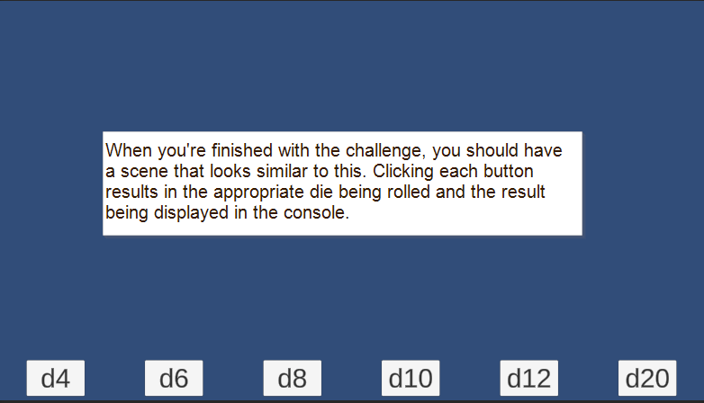

# What's Next?

Once you've added in several dice buttons, it's time to get the information
displaying on the screen. To do this, we will learn how to create our own
`UnityEvent`s. When you're ready, proceed to [Chapter 3: Adding an OnRoll Event].

---

[Horizontal Layout Group]: https://docs.unity.cn/2021.3/Documentation/Manual/script-HorizontalLayoutGroup.html

[Chapter 1: Modeling a Die]: 
[Chapter 3: Adding an OnRoll Event]: 
